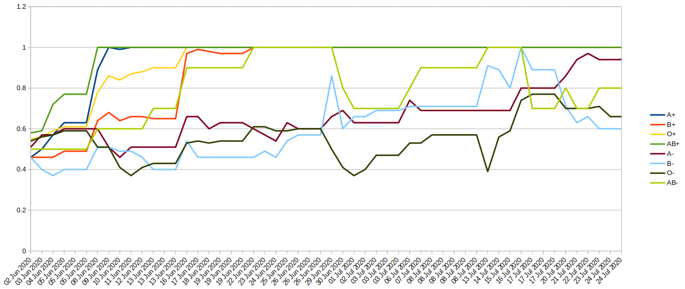

# Blood stock levels in Singapore

Run `python3 scrape.py`.

It retrieves the most recent blood stock levels for each blood group,
and appends them to `blood_levels.csv`.

Great to be run as a daily cron job.

Data source: https://www.redcross.sg/
